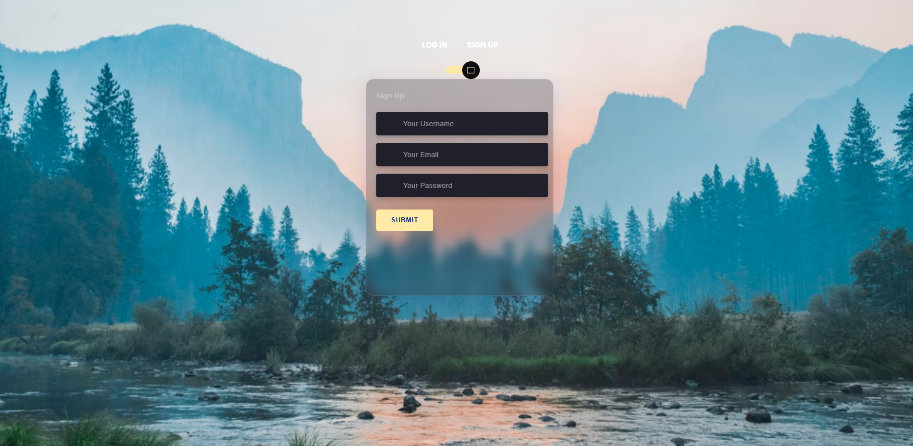
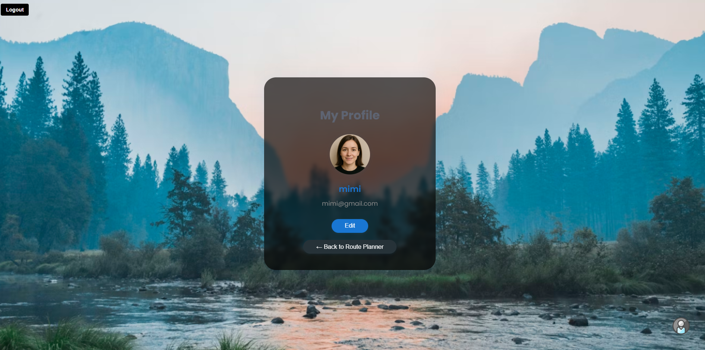
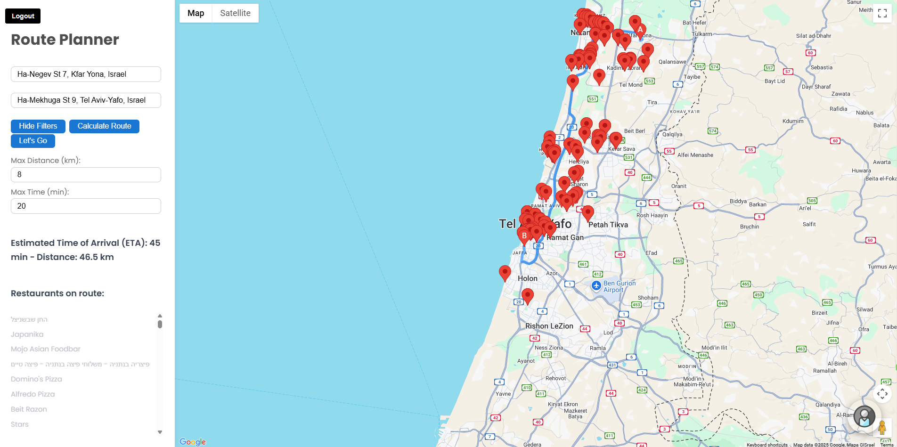

# 🍴 Roadeat – Restaurant Route Planner  

## 🚀 About the Project  
Roadeat is a **full-stack web application** that allows users to plan driving routes and discover restaurants along the way. It integrates Google Maps and Places APIs to provide route calculation, nearby restaurant search, filtering options, and real-time navigation.  
Enter an origin and destination, calculate your route, and instantly discover **restaurants along the way**.  
You can filter by detour distance and travel time, add stops to your route, and even use a **Waze-like navigation mode** to follow directions in real-time.  

👉 Built with **React + Django** and powered by the **Google Maps Platform**.  

---

## ✨ Key Features  
- 🔑 **Authentication** – Secure login & signup (JWT).  
- 🗺️ **Route Planning** – Driving routes with Google Directions API.  
- 🍽️ **Restaurant Discovery** – Live data from Google Places API.  
- 🔍 **Filters** – Max detour distance & additional travel time.  
- 📍 **Interactive Map** – Markers with details (name, rating, cuisine).  
- 🚗 **Route Updates** – ETA & distance update when stops are added.  
- ➕ **Multiple Stops** – Add one or more restaurants to the journey.  
- 🛰️ **Navigation Mode** – “Let’s Go” button for real-time turn-by-turn.  

---

## 🛠️ Tech Stack  
**Frontend:** React, Axios, React Router, @react-google-maps/api, Tailwind/CSS  
**Backend:** Django REST Framework, PostgreSQL/SQLite, JWT Auth  
**APIs:** Google Maps Directions, Google Places, Google Autocomplete  

---

## 📸 Screenshots 
 




---

## 📂 Project Structure  
```
roadeat/
├── backend/ # Django backend
│ ├── media/
│ ├── roadeatmap/ # Django app
│ │ ├── init.py
│ │ ├── admin.py
│ │ ├── apps.py
│ │ ├── migrations/
│ │ │ └── init.py
│ │ ├── models.py
│ │ ├── serializers.py
│ │ ├── tests.py
│ │ ├── urls.py
│ │ └── views.py
│ ├── roadfood/ # Django project
│ │ ├── init.py
│ │ ├── asgi.py
│ │ ├── settings.py
│ │ ├── urls.py
│ │ └── wsgi.py
│ ├── db.sqlite3
│ └── manage.py
│
├── frontend/ # React frontend
│ ├── android/ # Capacitor build files
│ ├── build/ # Production build
│ ├── node_modules/ # Dependencies
│ ├── public/ # Public assets
│ ├── src/ # Source code
│ │ ├── components/ # React components
│ │ │ ├── FloatingProfileButton.js
│ │ │ ├── FloatingProfileButton.css
│ │ │ ├── Login.js
│ │ │ ├── Login.css
│ │ │ ├── MapWithAdd.js
│ │ │ ├── MapWithGoogle.js
│ │ │ ├── ProfilePage.js
│ │ │ ├── RoutePlanner.js
│ │ │ └── RoutePlanner.css
│ │ ├── images/ # Local images
│ │ ├── App.js
│ │ ├── App.css
│ │ ├── App.test.js
│ │ ├── index.js
│ │ ├── index.css
│ │ ├── logo.svg
│ │ └── reportWebVitals.js
│ ├── capacitor.config.ts # Capacitor config for Android
│ ├── package.json
│ ├── package-lock.json
│ └── README.md
│
└── README.md # Project README
```

---

# 👩‍💻 For Developers  

## 🚀 Installation  

### Prerequisites  
- Python 3.10+  
- Node.js & npm  
- PostgreSQL (or SQLite for dev)  
- Google Maps API Key  

### Backend Setup  
```bash
cd backend
python -m venv venv
source venv/bin/activate   # On Windows: venv\Scripts\activate
pip install -r requirements.txt
# Make sure 'roadeatmap' is in INSTALLED_APPS (roadfood/settings.py)
python manage.py makemigrations roadeatmap
python manage.py migrate
python manage.py runserver
```

### Frontend Setup  
```bash
cd frontend
npm install
npm start
``` 

#### backend/.env  
```
SECRET_KEY=your_django_secret_key
DEBUG=True
DATABASE_URL=sqlite:///db.sqlite3
```

#### frontend/.env  
```
REACT_APP_GOOGLE_MAPS_API_KEY=your_google_maps_api_key
```

---

## 📖 Usage  
1. Register or log in.  
2. Enter origin and destination.  
3. Click **Calculate Route**.  
4. Explore nearby restaurants.  
5. Filter by distance/time if needed.  
6. Add a restaurant to your route.  
7. Start **Let’s Go** navigation to follow the route in real-time.  

---

## 📌 Roadmap  
- [ ] Add restaurant reviews & photos  
- [ ] Save favorite restaurants to user profile  
- [ ] Share planned routes with friends  
- [ ] Mobile-first PWA support  

---


## 📜 License  
MIT License © 2025  
